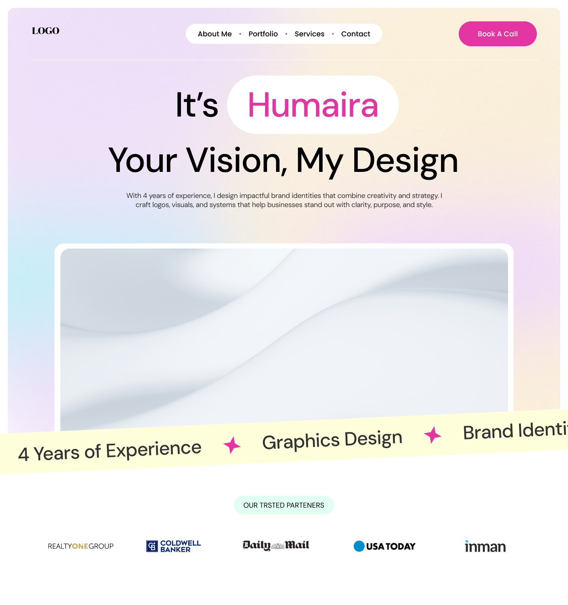

# 🎨 Art-Folio – Creative Portfolio & Agency Landing Page

[](https://art-folio.themefos.com)
[](https://nextjs.org/)
[](https://tailwindcss.com/)
[](https://greensock.com/gsap/)

Art-Folio is a modern, beautifully animated landing page template designed for **designers**, **creatives**, and **agencies** to showcase their work in style. Built with **Next.js**, **Tailwind CSS**, and **GSAP**, it ensures fast performance, smooth animations, and a responsive layout across all devices.

---

## 🚀 Live Demo

🔗 [https://art-folio.themefors.com](https://art-folio.themefors.com)

---

## 🛠️ Features

- ⚡ Built with **Next.js 14**
- 💨 Styled using **Tailwind CSS**
- ✨ Smooth scroll-based animations with **GSAP + ScrollTrigger**
- 🎯 Fully **responsive** and mobile-ready
- 🌓 Light/Dark mode friendly
- 🎨 Ideal for **designer portfolios** or **agency websites**
- 📦 Ready to deploy on **Vercel**

---

## 📁 Folder Structure

art-folio/
├── components/ # Reusable UI components
├── pages/ # Routing pages (Next.js)
├── public/ # Static assets (images, favicon, etc.)
├── styles/ # Global CSS (Tailwind + Fonts)
├── tailwind.config.js
└── next.config.js


---

## 🚀 Getting Started

### 1. Clone the repository

```bash
git clone https://github.com/Themefors/art-folio.git

cd art-folio

npm run dev

npm install

```

🖋 Customization

You can easily customize:

- Colors via tailwind.config.js

- Fonts via globals.css (DM Sans used by default)

- Animations via GSAP logic in components

📃 License

This template is licensed under Themefors License — for personal and commercial use.

🙋‍♂️ Author

Made with ❤️ by Shahriar Fardows
Design ❤️ by Shihab 
